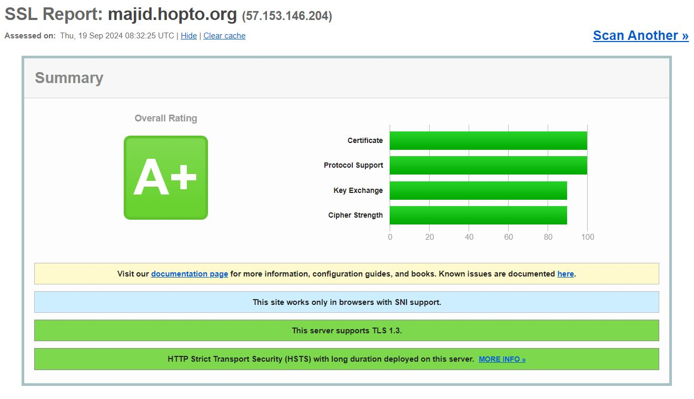

# Azure Platform Engineering Assignment


## Project Overview
This repository contains Terraform scripts and Kubernetes manifests to create a secure infrastructure on Azure using Kubernetes, NGINX Ingress, and cert-manager. The infrastructure is designed following best practices for resource allocation, security, and automation.

## Infrastructure Details

### 1. Azure Resource Group and Virtual Network
- **Location:** West Europe
- **Virtual Network:** Custom subnet in the West Europe location
- **Resource Group:** Created via Terraform

### 2. AKS Cluster
- **Node pool:** 1 node pool with 2 nodes
- **Version:** v1.29.7

### 3. NGINX Ingress Controller
- **Controller type:** DaemonSet
- **Sidecar container:** A busybox container attached with resource limits:
  - CPU: 0.2 cores
  - Memory: 256Mi
- **Volume:** Shared volume for NGINX logs between the controller and sidecar container
- **Security:** Web Application Firewall (WAF) enabled with OWASP ModSecurity Core Rule Set (CRS) in blocking mode

### 4. Hardened Docker Image
- A simple web page is containerized and pushed to private nexus registry `docker.akostage.ir`.
- Docker image is built with security best practices (none-root user, minimized layers, etc.).

### 5. Kubernetes Deployment
- **Replicas:** 2 replicas
- **Rolling update strategy:** 25% max surge
- **Labels:** Applied to the deployment for better identification and management
- **ImagePullPolicy:** Set to fetch the image only if not cached
 docker registry
- **Security context:**
  - Running the container as a non-root user
  - Specifying a custom security context
- **Resource limits:**
  - CPU and memory limits applied to the container
- **Custom port:** Container runs on port 8888
- **ClusterIP Service:** Exposes the application internally on port 80

### 6. DNS and SSL Configuration
- **Domain:** Free domain created https://majid.hopto.org using [No-IP](https://www.no-ip.com/) with the `.hopto.org` domain. 
- **Cert-manager:** Used to create a Let's Encrypt ClusterIssuer and manage SSL certificates.
- **Wildcard certificate:** Issued for the domain to secure the application with HTTPS.
- **Ingress:** Configured to route traffic to the web application using the wildcard certificate.

## Security and Validation

### 1. SSL/TLS Configuration
- **SSL Labs:** The application scores A+ on https://www.ssllabs.com with proper TLS configuration.


### 2. WAF (Web Application Firewall)
- **ModSecurity test:**
  Using the following `curl` command, the WAF responds with a Forbidden response, blocking malicious requests:
  ```bash
  curl 'https://majid.hopto.org/?q="><script>alert(1)</script>'