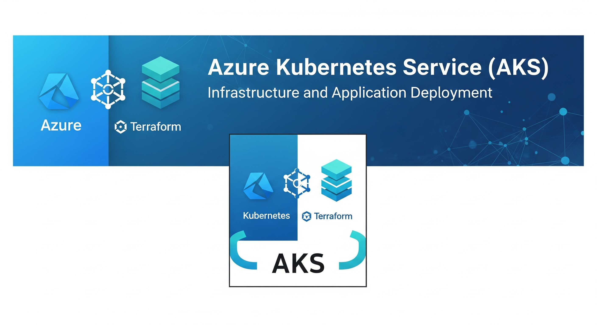

# Azure Kubernetes Service (AKS) Infrastructure and Application Deployment



## 📝 Overview

This repository contains the infrastructure as code (**IaC**) and deployment manifests for a robust and secure web application hosted on **Azure Kubernetes Service (AKS)**. The project leverages **Terraform** for infrastructure provisioning and a series of **Kubernetes** manifests and **Helm** charts for application deployment, ingress management, and security.

<hr>

## 🚀 Features

* **Infrastructure as Code (IaC)**: Deploys a complete AKS cluster and its networking components using **Terraform**.
* **Highly Available and Scalable Application**: The web application is deployed with a **rolling update** strategy and **multiple replicas** to ensure high availability.
* **NGINX Ingress Controller**: Manages external access to the application, providing features like **load balancing** and **SSL termination**.
* **Web Application Firewall (WAF)**: The ingress controller is configured with **ModSecurity** and the **OWASP Core Rule Set (CRS)** in **blocking mode** to protect against common web vulnerabilities.
* **Automated SSL/TLS Certificate Management**: **Cert-manager** is used with a **Let's Encrypt** cluster issuer to automatically provision and renew a **wildcard SSL certificate** for the application domain.
* **Container Security**: The application's Docker image is **hardened**, and the deployment uses **security contexts** and **resource limits** to enhance pod security and stability.
* **Logging**: A shared volume is configured for **NGINX logs**, enabling easy access for monitoring and troubleshooting.
* **DNS Integration**: The ingress is configured with a **DDNS name** for a custom, publicly accessible domain.

<hr>

## ⚙️ Technologies Used

| Category | Technology |
| :--- | :--- |
| **Cloud** | Azure |
| **IaC** | Terraform |
| **Containerization** | Docker |
| **Orchestration** | Kubernetes |
| **Package Manager**| Helm |
| **Ingress/WAF** | NGINX Ingress Controller, ModSecurity, OWASP CRS |
| **Certificates**| Cert-manager, Let's Encrypt |

<hr>

## 🔧 Prerequisites

* An **Azure** account with an active subscription.
* **Terraform** installed locally.
* **Azure CLI** installed and configured.
* **Kubectl** installed.
* **Helm** installed.
* **Docker** installed.
* A **DDNS** domain name (e.g., from No-IP or a public suffix list).

<hr>

## 🚀 How to Run

### Step 1: Terraform Deployment

1.  Navigate to the `terraform` directory.
2.  Initialize Terraform: `terraform init`.
3.  Review the plan: `terraform plan`.
4.  Apply the configuration to create the Azure resources: `terraform apply`.

<br>


---

### Step 2: Build and Push Docker Image

Before deploying the application, you'll need to **build a Docker image** for your web page and push it to a **container registry**.

1.  Navigate to your `web-application` directory.
2.  Build your Docker image using the provided `Dockerfile`:
    ```bash
    docker build -t <your-registry-name>/<your-image-name>:<tag> .
    ```
    (e.g., `docker build -t myacr.azurecr.io/simple-webpage:v1 .`)
3.  Log in to your container registry. For Azure Container Registry (ACR), use:
    ```bash
    az acr login --name <your-acr-name>
    ```
4.  Push the Docker image to your registry:
    ```bash
    docker push <your-registry-name>/<your-image-name>:<tag>
    ```

<br>

---

### Step 3: Configure Kubernetes Manifests

Update the Kubernetes manifests with your specific information before applying them.

1.  **Create a pull secret**: Create a Kubernetes secret to store your container registry credentials.
    * Open `kubernetes/manifests/regcred-secret.yaml` and replace the placeholder values with your **registry username, password, and email address**.
    * Apply the secret: `kubectl apply -f kubernetes/manifests/regcred-secret.yaml`.
2.  **Update the Deployment file**:
    * Open `kubernetes/manifests/deployment.yaml` and replace the `image` value with the **URL of the Docker image** you just pushed to your registry (e.g., `image: myacr.azurecr.io/simple-webpage:v1`).
3.  **Configure the Cluster Issuer**:
    * Open `kubernetes/manifests/issuer.yaml` and replace the placeholder email address with your **own email address**. This email is used by Let's Encrypt for important notifications about your certificate.

<br>

---

### Step 4: Kubernetes Deployment

1.  Connect to your new AKS cluster using `az aks get-credentials` .
2.  Deploy **cert-manager** using `helm install cert-manager jetstack/cert-manager --version v1.14.4 --set installCRDs=true` .
3.  Deploy the **NGINX ingress controller** using `helm install ingress-nginx ingress-nginx/ingress-nginx -f kubernetes/helm/nginx-ingress/values.yaml` .
4.  Apply cert-manager custome resurce manifests: `kubectl apply -f kubernetes/cert-manager/` .
5.  Apply the configured Kubernetes manifests: `kubectl apply -f kubernetes/manifests/`.

<hr>

## 🛡️ Security and Validation


* **SSL Labs A+ Rating**: Verify the security of your application's SSL/TLS configuration by checking its score on [SSL Labs](https://www.ssllabs.com/ssltest/). The configuration in this project is designed to achieve an **A+** rating.
* **WAF Blocking Test**: Use the following `curl` command to confirm that the WAF is correctly blocking malicious requests:
    ```bash
    curl 'https://your-application-url/?q="><script>alert(1)</script>'
    ```
    This command should return a `403 Forbidden` response, indicating the WAF successfully detected and blocked the cross-site scripting (XSS) attempt.